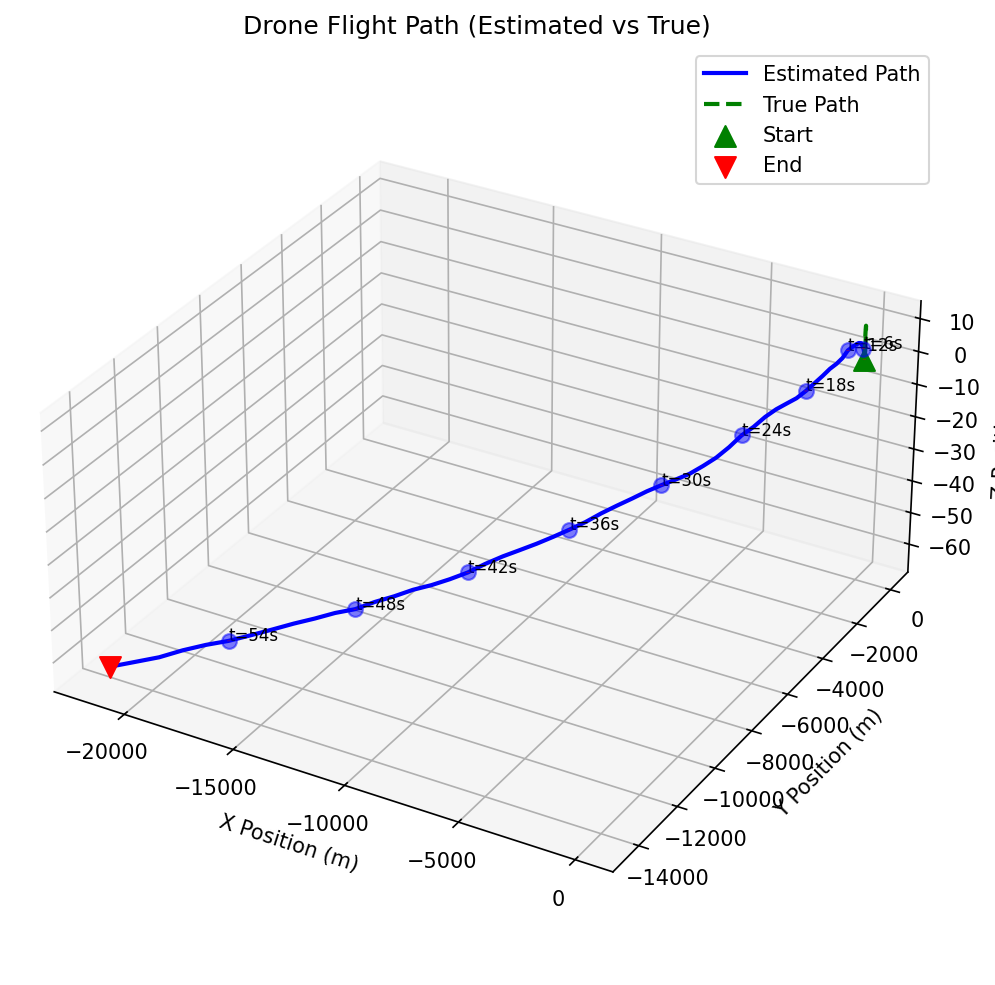
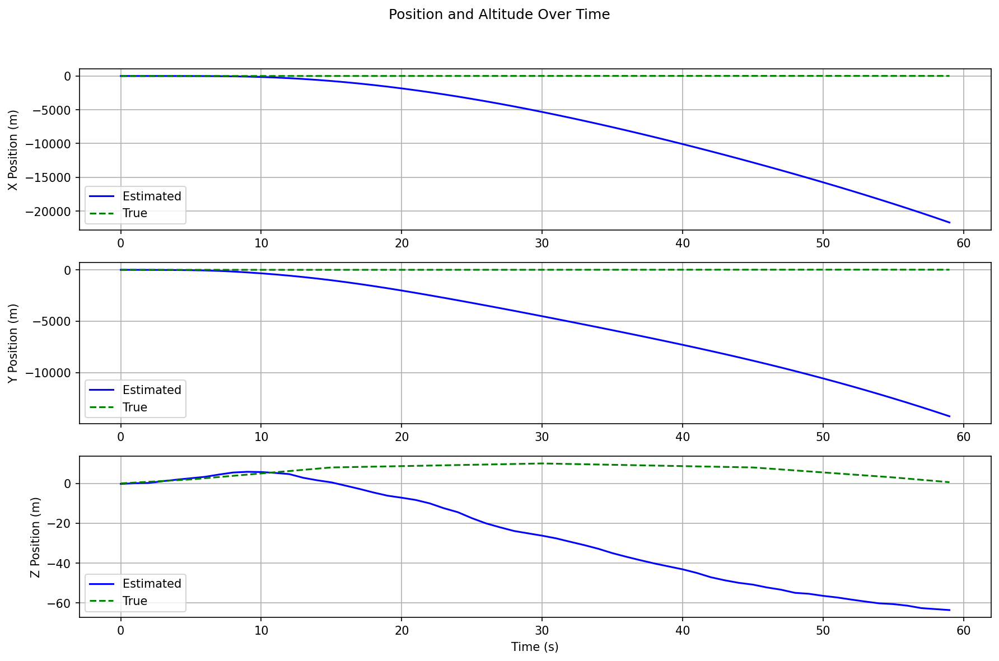
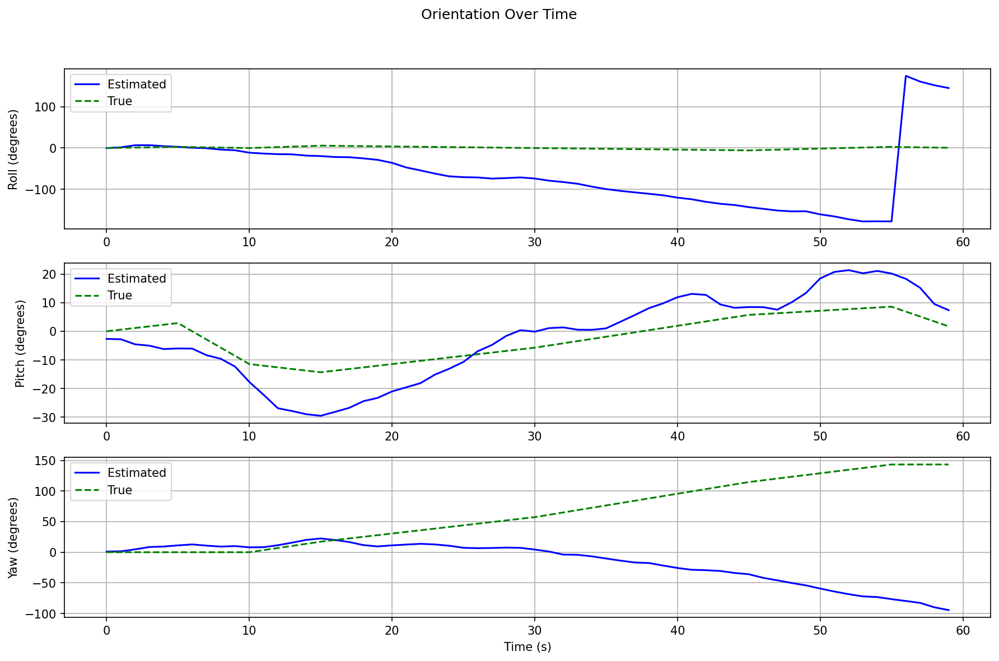
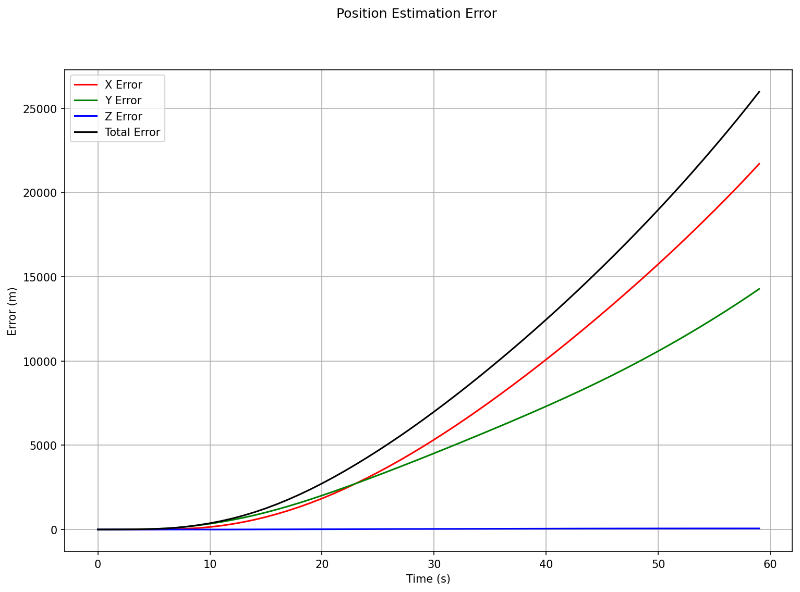
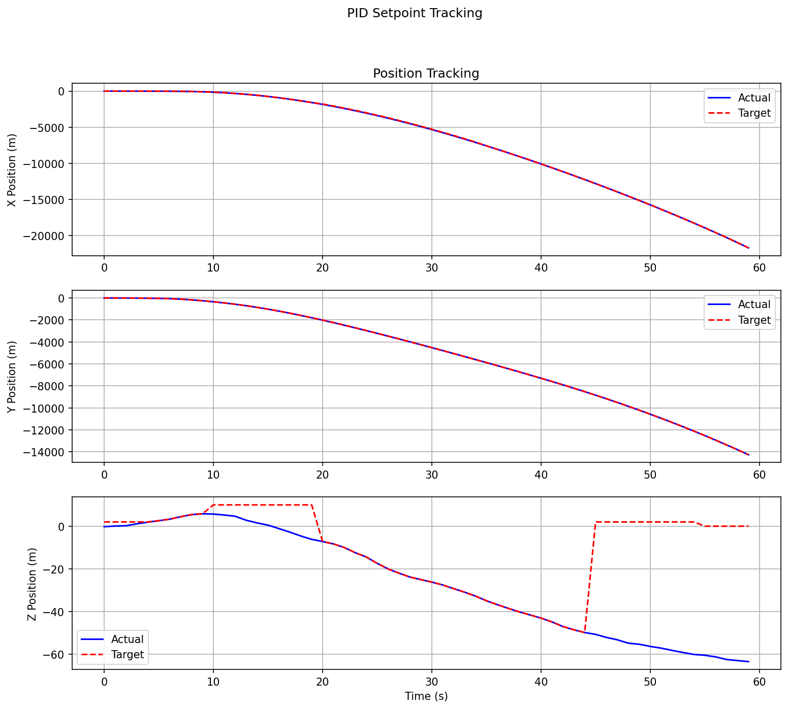
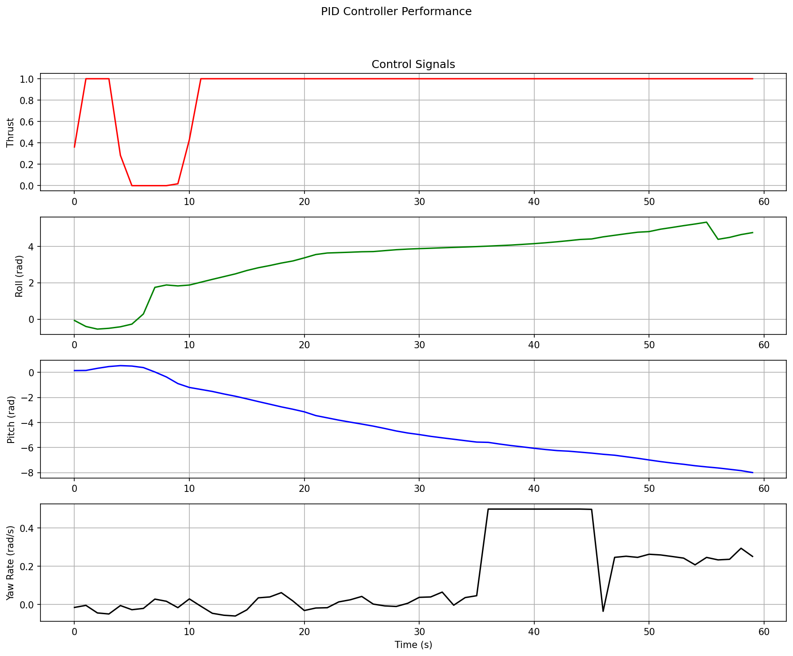

# AI Drone Auto-Navigation System

This is a comprehensive simulation of an autonomous drone navigation system that models drone behavior without GPS reliance. The system demonstrates sensor fusion techniques for position and orientation estimation while handling challenges like sensor drift, noise, and environmental disturbances.

## Features

- Kalman filtering for state estimation
- Finite State Machine (FSM) for behavior control
- Realistic sensor simulation with appropriate noise profiles
- PID control for flight stabilization with wind compensation
- Advanced visualization tools for flight data
- Environmental disturbances with multiple wind scenarios
- Web interface for controlling simulation parameters

## 📊 Simulation Plots

Below are flight result plots generated from the simulation.

<div align="center">
  <table>
    <tr>
      <td></td>
      <td></td>
      <td></td>
    </tr>
    <tr>
      <td></td>
      <td></td>
      <td></td>
    </tr>
    <tr>
      <td colspan="3"></td>
    </tr>
  </table>
</div>

## Project Structure

- `core/`: Core drone logic (drone state, FSM, PID controller)
- `infrastructure/`: Support systems (sensors, environment)
- `presentation/`: Visualization and logging
- `plots/`: Generated visualization plots
- `templates/`: Web interface HTML templates
- `app.py`: Flask web application
- `main.py`: Main simulation orchestration

## Installation

1. Clone this repository
2. Install the required packages:

```bash
pip install -r requirements.txt
```

## Running the Simulation

### Console Mode

To run the simulation directly in console mode:

```bash
python main.py
```

This will execute a full drone flight simulation and generate plots in the `plots/` directory.

### Web Interface

To run the simulation with the web interface:

```bash
# For development
python -m flask --app app run --host=0.0.0.0 --port=5000

# For production
gunicorn --bind 0.0.0.0:5000 app:app
```

Then open a web browser and navigate to `http://localhost:5000`

## Using the Web Interface

The web interface allows you to:

1. Start and stop simulations
2. Select different wind scenarios (calm, light, moderate, strong, stormy, gusty)
3. Configure PID controller gains
4. View real-time visualization of drone flight data
5. Monitor drone state and environmental conditions

## PID Controller Configuration

The drone uses several PID controllers to maintain stability:

- **Altitude Controller**: Controls vertical movement and height
- **Position Controller**: Controls horizontal movement in X and Y directions
- **Orientation Controller**: Controls roll, pitch, and yaw angles

Each controller can be tuned by adjusting its PID gains through the web interface.

## Wind Scenarios

The simulation includes several wind scenarios to test drone stability:

- **Calm**: Almost no wind (0-1 m/s)
- **Light**: Light breeze (1-3 m/s)
- **Moderate**: Moderate wind (3-5 m/s)
- **Strong**: Strong wind (5-8 m/s)
- **Stormy**: Storm conditions (8-12 m/s)
- **Gusty**: Moderate wind with frequent gusts

## Enhanced PID Controllers with Wind Compensation

The simulation includes advanced wind compensation mechanisms:

1. Adaptive scaling based on wind strength
2. Integral wind compensation for persistent wind
3. Vertical velocity compensation in strong wind
4. Wind moment compensation for orientation stability